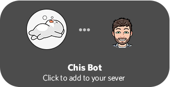

# Chis Bot

A Discord bot that provides users with a simple interface to plan pick up Valorant games.  

## Usage

*For additional information, run `$help` bot comand*

| Command | Description                                                                       |
| ------- | --------------------------------------------------------------------------------- |
| $plan   | Takes in a number of players, creates a new game.                                 |
| $add    | Add users by @tag or by typing the display name.                                  |
| $delete | Delete users by @tag or by typing the display name.                               |
| $team   | Give a list of valid captains to start team selection.                            |
| $play   | Click on the letter corresponding to the correct voice channel to move each team. |
| $move   | Move all players to the same voice channel                                        |
| $side   | Randomly picks a side, (Attackers, Defenders)                                     |
| $map    | Randomly picks a Valorant map                                                     |

Notes:  

- *Accepted types for users: @Name, Name, "Name With Spaces"*

*Please give support to [zacharied](https://github.com/zacharied) for the wonderful [Discord React-Prompt library](https://github.com/zacharied/discord-eprompt).*
