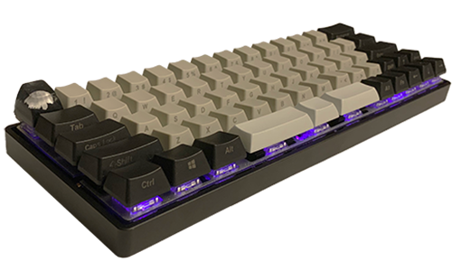
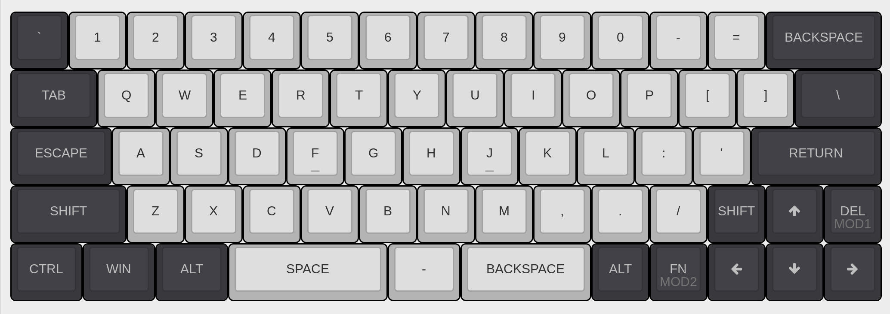
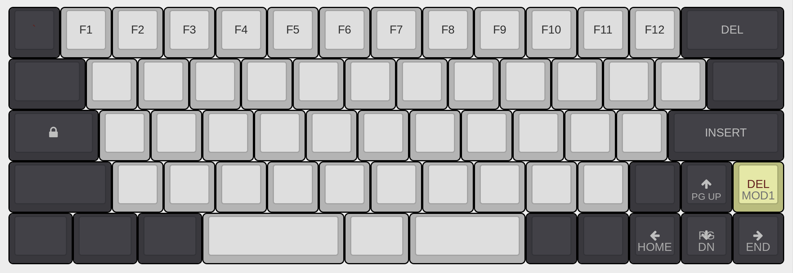
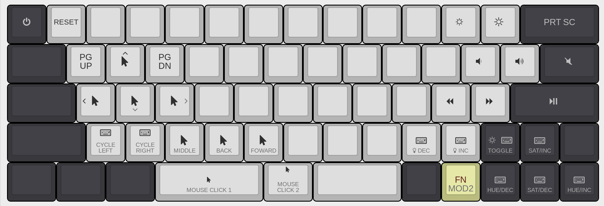

## Keyboard

### Layout

    
Default Layout

    

    
Function Layout

    

    
Media Layout

    

### Parts

- Mountain escape key (SA profile)
- GK64 XD64 DZ60 PBT keycaps - black & light gray (Cherry profile)
- Gray DSA spacebars (2.75/1.25/2.25)
- Zelios 65g switches (lubed with Krytox 205)
- Stabilizers are "band-aid modded"
- DZ60 60% USB-C PCB
- 60% aluminum low profile black case from KBDfans

### Firmware

Contributed to [QMK GitHub repository](https://github.com/qmk/qmk_firmware/tree/master/keyboards/dz60/keymaps/chrisae9).