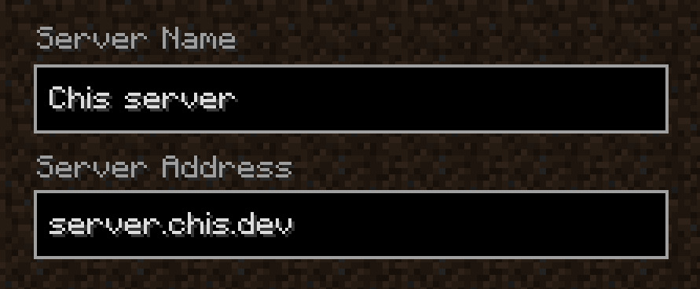

# Mineraft Server 1.16.4

## How to Join

## World Maps

#### [Overworld](https://www.chunkbase.com/apps/seed-map#115157112644938149)

#### [Nether](https://www.chunkbase.com/apps/seed-map#-3438722920215551271)

#### [The End](https://www.chunkbase.com/apps/seed-map#-4405026340778613849)

## Commands

Here is a list of commands that are not part of vanilla minecraft but are on the server.

## Advanced Teleport

[Link to website](https://www.spigotmc.org/resources/advanced-teleport.64139/)

### TP Commands

| Command            | Description                                |
|--------------------|--------------------------------------------|
| /tpo <player>      | Instantly teleports you to another player. |
| /tpohere <player>  | Instantly teleports another player to you. |
| /tploc <x> <y> <z> | Teleports you to specified coordinates.    |
| /rtp               | Teleports you to a random place.           |
| /spawn             | Teleports you to the spawn.                |
| /back              | Teleports you to your last location.       |
### Home Commands

| Command               | Description                                 |
|-----------------------|---------------------------------------------|
| /home <home name/bed> | Teleports you to your home/bed location.    |
| /homes                | Gives you a list of home points you've set. |
| /sethome <home name>  | Sets a home point at your location.         |
| /delhome <home name>  | Removes a home point you have.              |
### Warp Commands

| Command                  | Description                              |
|--------------------------|------------------------------------------|
| /warp <warp name>        | Teleports you to an existing warp point. |
| /warps                   | Gives you a list of warps.               |
| /warp set <warp name>    | Sets a warp point at the place you are.  |
| /warp delete <warp name> | Deletes a warp point you've set.         |
